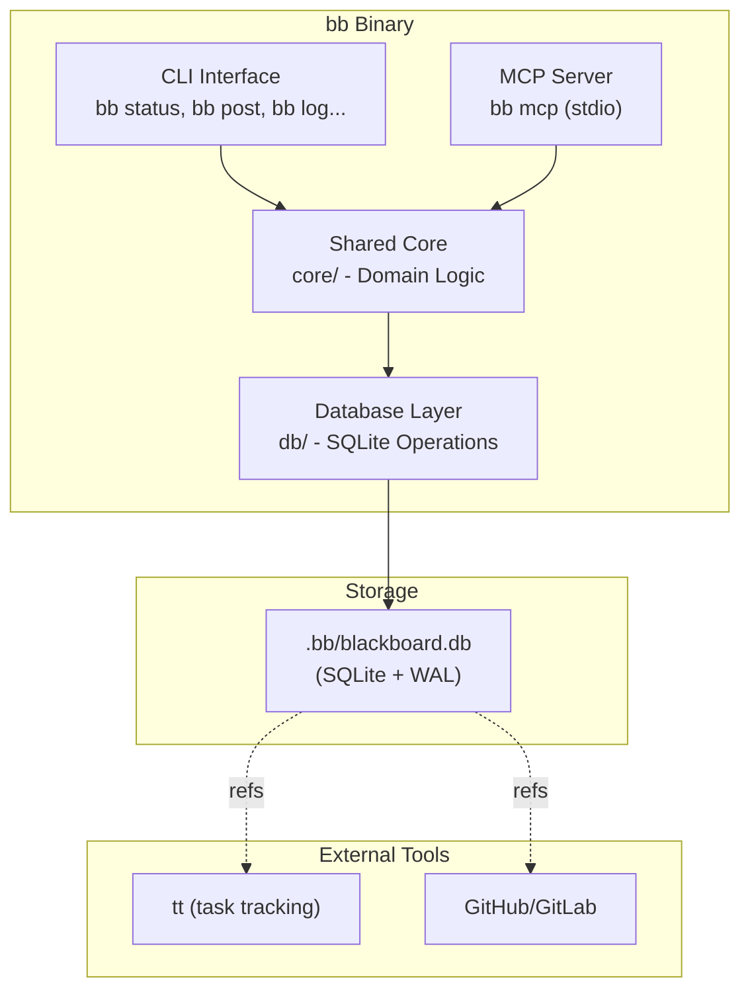

# Blackboard (`bb`) System Architecture

> **Note**: This document describes the architecture per SPEC.md.

---

## 1. High-Level Architecture

Blackboard (`bb`) is a local, SQLite-backed coordination surface for AI coding agents and humans. It follows a **dual-interface, shared-core** pattern.



**Key Design Decisions:**
- Local tool for local agents - no authentication, no rate limiting
- Open → transact → close per operation (per SPEC 14.3)
- WAL mode for concurrent reads
- MCP is the primary interface for agents

---

## 2. Module Structure

```text
bb/
├── src/
│   ├── main.rs              # Entry point: CLI dispatch + MCP dispatch
│   ├── cli/                 # Clap commands and output formatting
│   │   ├── mod.rs
│   │   ├── commands/
│   │   │   ├── mod.rs
│   │   │   ├── init.rs      # bb init
│   │   │   ├── status.rs    # bb status, bb status set, bb status get
│   │   │   ├── message.rs   # bb log, bb post, bb message
│   │   │   ├── artifact.rs  # bb artifacts, bb artifact add/show
│   │   │   ├── ref.rs       # bb refs
│   │   │   ├── clear.rs     # bb clear
│   │   │   ├── export.rs   # bb export
│   │   │   ├── summary.rs   # bb summary
│   │   │   └── install.rs   # bb install
│   │   └── output.rs        # Table formatting, JSON formatting
│   │
│   ├── mcp/                 # rmcp server + tool handlers
│   │   ├── mod.rs
│   │   ├── server.rs        # MCP server initialization
│   │   ├── tools.rs         # Tool definitions
│   │   └── identity.rs      # Identity resolution
│   │
│   ├── core/                # Domain logic (shared by CLI and MCP)
│   │   ├── mod.rs
│   │   ├── models/          # Domain models
│   │   │   ├── mod.rs
│   │   │   ├── agent.rs     # Agent struct and status enum
│   │   │   ├── message.rs   # Message struct and priority enum
│   │   │   ├── artifact.rs  # Artifact struct
│   │   │   └── reference.rs # Reference struct
│   │   ├── operations/     # Business logic
│   │   │   ├── mod.rs
│   │   │   ├── agent.rs     # Agent CRUD, liveness detection
│   │   │   ├── message.rs   # Message posting, reading, filtering
│   │   │   ├── artifact.rs  # Artifact upsert, listing
│   │   │   └── reference.rs # Reference lookups
│   │   ├── validation/      # Input validation
│   │   │   ├── mod.rs
│   │   │   ├── ref.rs       # Reference format validation
│   │   │   ├── duration.rs  # Duration parsing (10m, 1h, 2d)
│   │   │   └── limits.rs    # Size limits validation
│   │   └── errors.rs        # Error types (BBError enum)
│   │
│   ├── db/                  # SQLite connection, schema, queries
│   │   ├── mod.rs
│   │   ├── connection.rs    # Connection setup + pragmas
│   │   ├── schema.rs        # Table definitions
│   │   ├── queries/         # SQL queries
│   │   │   ├── mod.rs
│   │   │   ├── agent.rs     # Agent queries
│   │   │   ├── message.rs   # Message queries
│   │   │   └── artifact.rs  # Artifact queries
│   │   └── migrations.rs    # Schema migrations
│   │
│   └── util/                # Utilities
│       ├── mod.rs
│       ├── discovery.rs     # .bb/ directory discovery
│       ├── duration.rs      # Duration parsing
│       └── ref.rs           # Reference string parsing
│
└── tests/                   # Integration tests
```

---

## 3. Database Layer

### 3.1 Connection Lifecycle (per SPEC 14.3)

```rust
// Open → transact → close per operation
pub fn with_connection<F, T>(project_dir: &Path, f: F) -> BBResult<T>
where
    F: FnOnce(&mut Connection) -> BBResult<T>,
{
    let db_path = project_dir.join(".bb").join("blackboard.db");
    let mut conn = Connection::open(&db_path)?;
    
    // Set pragmas for every connection
    conn.execute_batch(
        "PRAGMA journal_mode = WAL;
         PRAGMA busy_timeout = 5000;
         PRAGMA foreign_keys = ON;"
    )?;
    
    f(&mut conn)
}
```

### 3.2 Schema (per SPEC 6.2)

```sql
PRAGMA journal_mode = WAL;
PRAGMA busy_timeout = 5000;
PRAGMA foreign_keys = ON;

CREATE TABLE schema_version (
    version INTEGER NOT NULL
);
INSERT INTO schema_version (version) VALUES (1);

CREATE TABLE agents (
    id TEXT PRIMARY KEY,
    current_task TEXT NOT NULL DEFAULT '',
    progress INTEGER NOT NULL DEFAULT 0
        CHECK (progress >= 0 AND progress <= 100),
    status TEXT NOT NULL DEFAULT 'idle'
        CHECK (status IN (
            'idle', 'planning', 'coding', 'testing',
            'reviewing', 'blocked', 'offline'
        )),
    blockers TEXT,
    last_seen TIMESTAMP NOT NULL DEFAULT CURRENT_TIMESTAMP,
    updated_at TIMESTAMP NOT NULL DEFAULT CURRENT_TIMESTAMP
);

CREATE TABLE messages (
    id INTEGER PRIMARY KEY AUTOINCREMENT,
    from_agent TEXT NOT NULL,
    content TEXT NOT NULL,
    tags TEXT NOT NULL DEFAULT '[]'
        CHECK (json_valid(tags)),
    priority TEXT NOT NULL DEFAULT 'normal'
        CHECK (priority IN ('low', 'normal', 'high', 'critical')),
    in_reply_to INTEGER REFERENCES messages(id),
    refs TEXT NOT NULL DEFAULT '[]'
        CHECK (json_valid(refs)),
    created_at TIMESTAMP NOT NULL DEFAULT CURRENT_TIMESTAMP
);

CREATE TABLE artifacts (
    id INTEGER PRIMARY KEY AUTOINCREMENT,
    path TEXT NOT NULL UNIQUE,
    produced_by TEXT NOT NULL,
    description TEXT NOT NULL DEFAULT '',
    version TEXT,
    refs TEXT NOT NULL DEFAULT '[]'
        CHECK (json_valid(refs)),
    created_at TIMESTAMP NOT NULL DEFAULT CURRENT_TIMESTAMP
);

CREATE INDEX idx_agents_status ON agents(status);
CREATE INDEX idx_agents_last_seen ON agents(last_seen);
CREATE INDEX idx_messages_created_at ON messages(created_at DESC);
CREATE INDEX idx_messages_from_agent ON messages(from_agent);
CREATE INDEX idx_messages_priority ON messages(priority) WHERE priority IN ('high', 'critical');
CREATE INDEX idx_messages_in_reply_to ON messages(in_reply_to)
    WHERE in_reply_to IS NOT NULL;
CREATE INDEX idx_artifacts_path ON artifacts(path);
CREATE INDEX idx_artifacts_produced_by ON artifacts(produced_by);
```

### 3.3 Migrations

Simple embedded migrations (per SPEC 14.3):

```rust
// src/db/migrations.rs
pub const SCHEMA_SQL: &str = include_str!("../../migrations/001_initial.sql");

pub fn init_schema(conn: &Connection) -> BBResult<()> {
    conn.execute_batch(SCHEMA_SQL)?;
    Ok(())
}
```

---

## 4. Core Data Models

### 4.1 Agent Model

```rust
// src/core/models/agent.rs
pub struct Agent {
    pub id: String,
    pub current_task: String,
    pub progress: u8,
    pub status: AgentStatus,
    pub blockers: Option<String>,
    pub last_seen: DateTime<Utc>,
    pub updated_at: DateTime<Utc>,
}

pub enum AgentStatus {
    Idle,
    Planning,
    Coding,
    Testing,
    Reviewing,
    Blocked,
    Offline,
}

impl Agent {
    pub const MAX_ID_LEN: usize = 64;
    pub const MAX_TASK_LEN: usize = 256;
    pub const MAX_BLOCKERS_LEN: usize = 1024;
}
```

### 4.2 Message Model

```rust
// src/core/models/message.rs
pub struct Message {
    pub id: i64,
    pub from_agent: String,
    pub content: String,
    pub tags: Vec<String>,
    pub priority: Priority,
    pub in_reply_to: Option<i64>,
    pub refs: Vec<Reference>,
    pub created_at: DateTime<Utc>,
}

pub enum Priority {
    Low,
    Normal,
    High,
    Critical,
}

impl Priority {
    pub fn level(&self) -> u8 {
        match self {
            Priority::Low => 0,
            Priority::Normal => 1,
            Priority::High => 2,
            Priority::Critical => 3,
        }
    }
}
```

### 4.3 Artifact Model

```rust
// src/core/models/artifact.rs
pub struct Artifact {
    pub id: i64,
    pub path: String,
    pub produced_by: String,
    pub description: String,
    pub version: Option<String>,
    pub refs: Vec<Reference>,
    pub created_at: DateTime<Utc>,
}
```

---

## 5. Core Operations

### 5.1 Liveness Detection (per SPEC 8.1)

**Critical**: Side-effect read updates agents to offline:

```rust
// src/core/operations/agent.rs
const LIVENESS_ACTIVE_MINUTES: i64 = 5;
const LIVENESS_STALE_MINUTES: i64 = 30;

pub fn get_agents_with_liveness(conn: &mut Connection) -> BBResult<Vec<Agent>> {
    let tx = conn.transaction()?;
    
    // Side-effect: update stale agents to offline
    tx.execute(
        "UPDATE agents 
         SET status = 'offline' 
         WHERE status != 'offline' 
           AND datetime(last_seen) < datetime('now', '-' || ? || ' minutes')",
        [LIVENESS_STALE_MINUTES],
    )?;
    
    tx.commit()?;
    
    // Now fetch agents
    let mut stmt = conn.prepare(
        "SELECT id, current_task, progress, status, blockers, last_seen, updated_at
         FROM agents ORDER BY last_seen DESC"
    )?;
    
    let agents = stmt.query_map([], |row| {
        Ok(Agent { /* ... */ })
    })?.collect::<Result<Vec<_>, _>>()?;
    
    Ok(agents)
}

pub fn classify_liveness(last_seen: DateTime<Utc>) -> Liveness {
    let elapsed = Utc::now().signed_duration_since(last_seen);
    if elapsed.num_minutes() <= LIVENESS_ACTIVE_MINUTES {
        Liveness::Active
    } else if elapsed.num_minutes() <= LIVENESS_STALE_MINUTES {
        Liveness::Stale
    } else {
        Liveness::Offline
    }
}
```

### 5.2 Message Operations

Pagination via `--limit`:

```rust
pub fn list_messages(
    conn: &mut Connection,
    since: Option<DateTime<Utc>>,
    tags: &[String],
    from_agent: Option<&str>,
    priority: Option<Priority>,
    limit: usize,
) -> BBResult<Vec<Message>> {
    let limit = limit.min(100); // Max 100
    
    let mut sql = String::from(
        "SELECT id, from_agent, content, tags, priority, in_reply_to, refs, created_at
         FROM messages WHERE 1=1"
    );
    let mut params: Vec<Box<dyn rusqlite::ToSql>> = Vec::new();
    
    // ... build query with filters ...
    
    sql.push_str(&format!(" ORDER BY created_at DESC LIMIT {}", limit));
    
    // Execute and parse
}
```

### 5.3 Artifact Operations

Path validation for new artifacts:

```rust
// src/core/validation/path.rs
pub fn validate_artifact_path(path: &str, project_root: &Path) -> BBResult<PathBuf> {
    // Reject absolute paths
    if Path::new(path).is_absolute() {
        return Err(BBError::PathTraversal("absolute path not allowed".into()));
    }
    
    // Reject path traversal attempts
    if path.contains("..") || path.starts_with('/') || path.starts_with('\\') {
        return Err(BBError::PathTraversal("path traversal not allowed".into()));
    }
    
    // Validate path doesn't escape project directory
    let full_path = project_root.join(path);
    let canonical = full_path.canonicalize()
        .map_err(|_| BBError::InvalidInput(format!("invalid path: {}", path)))?;
    
    let project_canonical = project_root.canonicalize()
        .map_err(|_| BBError::InvalidInput("invalid project directory".into()))?;
    
    if !canonical.starts_with(&project_canonical) {
        return Err(BBError::PathTraversal("path escapes project directory".into()));
    }
    
    Ok(full_path)
}
```

---

## 6. CLI Module

### 6.1 Command Structure

| Command | Description |
|---------|-------------|
| `bb init` | Create `.bb/` and initialize DB |
| `bb install [claude\|kimi\|kilo]` | Print MCP installation instructions |
| `bb destroy --confirm` | Remove `.bb/` directory entirely |
| `bb status` | Table of all agents with liveness |
| `bb status set "<task>"` | Set agent status fields |
| `bb status get <agent_id>` | Detailed status for one agent |
| `bb status clear` | Reset to idle, empty task, progress=0 |
| `bb log` | Show recent messages (default last 20) |
| `bb post "<content>"` | Post a message (supports `--reply-to <id>`, `--tag`, `--priority`, `--ref`) |
| `bb message <id>` | Show one message + its replies (thread) |
| `bb artifacts` | List artifacts |
| `bb artifact add "<path>" "<description>"` | Upsert artifact |
| `bb artifact show "<path>"` | Show artifact details |
| `bb refs <where:what:ref>` | Find all references |
| `bb clear [options]` | Bulk cleanup (messages, offline agents, artifacts) |
| `bb clear --artifacts --confirm` | Clear artifacts without confirmation prompt |
| `bb export` | Dump as JSON |
| `bb summary` | Compact overview |

### 6.2 List Command Defaults

| Command | Default Limit | Max Limit |
|---------|---------------|------------|
| `bb log` | 20 | 100 |
| `bb artifacts` | 50 | 100 |
| `bb status` | (no limit) | — |

### 6.3 Global Options

| Option | Description |
|--------|-------------|
| `--as <agent_id>` | Agent identity (default `human`) |
| `--json` | JSON output |
| `--dir <path>` | Explicit project directory |
| `--quiet` | Suppress non-essential output |

### 6.4 Thread Depth

Per SPEC 14.4, implementations SHOULD guard against pathological thread sizes (cap output at reasonable depth, e.g., 50 messages).

---

## 7. MCP Server Module

### 7.1 Identity Resolution (per SPEC 7.2.2)

Precedence: `--agent` > `BB_AGENT_ID` > `bb_identify`

```rust
// src/mcp/identity.rs
pub struct IdentityResolver {
    fixed_agent: Option<String>,  // From --agent
    env_agent: Option<String>,   // From BB_AGENT_ID
    resolved: Option<String>,    // From bb_identify
}

impl IdentityResolver {
    pub fn resolve(&self) -> Option<&str> {
        self.fixed_agent
            .as_deref()
            .or(self.env_agent.as_deref())
            .or(self.resolved.as_deref())
    }
    
    pub fn identify(&mut self, agent_id: &str) -> BBResult<()> {
        if self.fixed_agent.is_some() {
            return Err(BBError::InvalidInput(
                "identity already fixed by --agent".into()
            ));
        }
        
        if let Some(env_id) = &self.env_agent {
            if env_id != agent_id {
                return Err(BBError::InvalidInput(
                    "cannot change identity set by BB_AGENT_ID".into()
                ));
            }
        }
        
        if let Some(existing) = &self.resolved {
            if existing != agent_id {
                return Err(BBError::InvalidInput(
                    "identity already set".into()
                ));
            }
        } else {
            self.resolved = Some(agent_id.to_string());
        }
        
        Ok(())
    }
}
```

### 7.2 MCP Tools (per SPEC 7.2.4)

| Tool Name | Description |
|-----------|-------------|
| `bb_identify` | Establish agent identity |
| `bb_set_status` | Update agent status fields |
| `bb_get_status` | Get agent(s) with liveness |
| `bb_post_message` | Post a message |
| `bb_read_messages` | Read messages with filters |
| `bb_register_artifact` | Upsert artifact |
| `bb_list_artifacts` | List artifacts |
| `bb_find_refs` | Find references |
| `bb_summary` | Compact overview |

### 7.2.3 Environment Variables

| Variable | Description |
|----------|-------------|
| `BB_AGENT_ID` | Agent identity (optional) |
| `BB_DIR` | Explicit project directory (overrides discovery) |

### 7.3 Graceful Shutdown

```rust
// src/mcp/server.rs
pub async fn run_mcp_server(args: McpArgs) -> BBResult<()> {
    let shutdown = tokio::spawn(async move {
        tokio::signal::ctrl_c().await.ok();
    });
    
    // ... server logic ...
    
    tokio::select! {
        _ = shutdown => {}
        _ = tokio::time::sleep(Duration::from_secs(5)) => {
            // Force exit after timeout
        }
    }
    
    Ok(())
}
```

---

## 8. Input Validation

### 8.1 Size Limits

```rust
// src/core/validation/limits.rs
pub const MAX_AGENT_ID_LEN: usize = 64;
pub const MAX_TASK_LEN: usize = 256;
pub const MAX_BLOCKERS_LEN: usize = 1024;
pub const MAX_MESSAGE_CONTENT_LEN: usize = 65536;
pub const MAX_ARTIFACT_PATH_LEN: usize = 4096;
pub const MAX_ARTIFACT_DESC_LEN: usize = 1024;
pub const MAX_VERSION_LEN: usize = 64;
pub const MAX_TAG_LEN: usize = 32;
pub const MAX_TAGS_PER_MESSAGE: usize = 10;
pub const MAX_REFS_PER_ENTITY: usize = 20;
```

### 8.2 Reference Validation

Per SPEC 4.4 and 7.2.6:

```rust
// src/core/validation/ref.rs
pub fn parse_ref(s: &str) -> BBResult<Reference> {
    let parts: Vec<&str> = s.split(':').collect();
    if parts.len() != 3 {
        return Err(BBError::InvalidRefFormat(s.into()));
    }
    
    let where_ = parts[0].to_string();
    let what = parts[1].to_string();
    let ref_ = if parts[2].chars().all(|c| c.is_ascii_digit()) {
        serde_json::Value::Number(parts[2].parse().unwrap().into())
    } else {
        serde_json::Value::String(parts[2].to_string())
    };
    
    Ok(Reference { where_, what, ref_ })
}
```

### 8.3 Duration Parsing

Per SPEC 14.5:

```rust
// src/core/validation/duration.rs
pub fn parse_duration(s: &str) -> BBResult<Duration> {
    let s = s.trim();
    let num: u64 = s[..s.len()-1].parse()
        .map_err(|_| BBError::InvalidInput("invalid duration".into()))?;
    
    let unit = s.chars().last().unwrap();
    let seconds = match unit {
        's' => num,
        'm' => num * 60,
        'h' => num * 3600,
        'd' => num * 86400,
        'w' => num * 604800,
        _ => return Err(BBError::InvalidInput("invalid duration unit".into())),
    };
    
    Ok(Duration::seconds(seconds as i64))
}
```

---

## 9. Error Handling

### 9.1 Error Types

```rust
// src/core/errors.rs
pub enum BBError {
    NotInitialized,
    DatabaseBusy,
    InvalidInput(String),
    InvalidRefFormat(String),
    PathTraversal(String),
    NotFound(String),
    IdentityRequired,
    InvalidIdentity(String),
    IoError(std::io::Error),
    SqliteError(rusqlite::Error),
}

impl BBError {
    pub fn code(&self) -> &str {
        match self {
            Self::NotInitialized => "NOT_INITIALIZED",
            Self::DatabaseBusy => "DATABASE_BUSY",
            Self::InvalidInput(_) => "INVALID_INPUT",
            Self::InvalidRefFormat(_) => "INVALID_REF_FORMAT",
            Self::PathTraversal(_) => "PATH_TRAVERSAL",
            Self::NotFound(_) => "NOT_FOUND",
            Self::IdentityRequired => "IDENTITY_REQUIRED",
            Self::InvalidIdentity(_) => "INVALID_IDENTITY",
            _ => "INTERNAL_ERROR",
        }
    }
}
```

---

## 10. Testing Strategy

### 10.1 Unit Tests

- Duration parser (valid/invalid)
- Ref parser (valid/invalid; numeric vs string ref)
- Priority ordering
- Liveness classification
- Identity resolution precedence
- `bb_identify` semantics

### 10.2 Integration Tests

Using `assert_cmd` + `tempfile`:

- `bb init` creates `.bb/`, DB, `.gitignore`
- Discovery from subdirectories
- Commands fail when not initialized
- Post + log roundtrip
- Refs attach and find
- Artifact upsert
- `--json` output
- `bb install` emits MCP snippets

### 10.3 E2E Tests

- Process-level concurrency (multiple bb processes)
- MCP identity handling
- Liveness side-effect updates

---

## 11. Key Principles

1. **Dual Interface, Shared Core**: CLI and MCP invoke same core operations
2. **SQLite with WAL**: Persistent, concurrent-accessible storage
3. **Identity Resolution**: `--agent` > `BB_AGENT_ID` > `bb_identify`
4. **Append-Only Messages**: No edits, no deletes (except bulk cleanup)
5. **Artifact Upserts**: Keyed by path
6. **Liveness Detection**: Side-effect read updates to offline (per SPEC 8.1)
7. **Open-Transact-Close**: Per-operation connections (per SPEC 14.3)
8. **Defense in Depth**: Validation at API boundary + DB constraints
