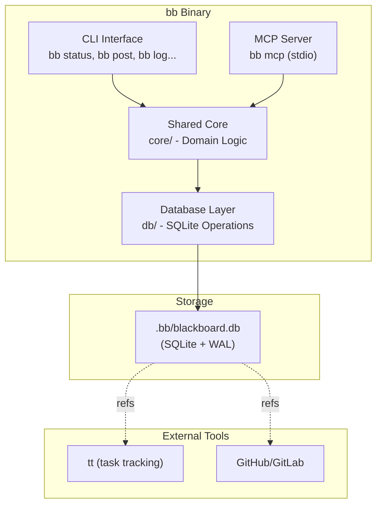
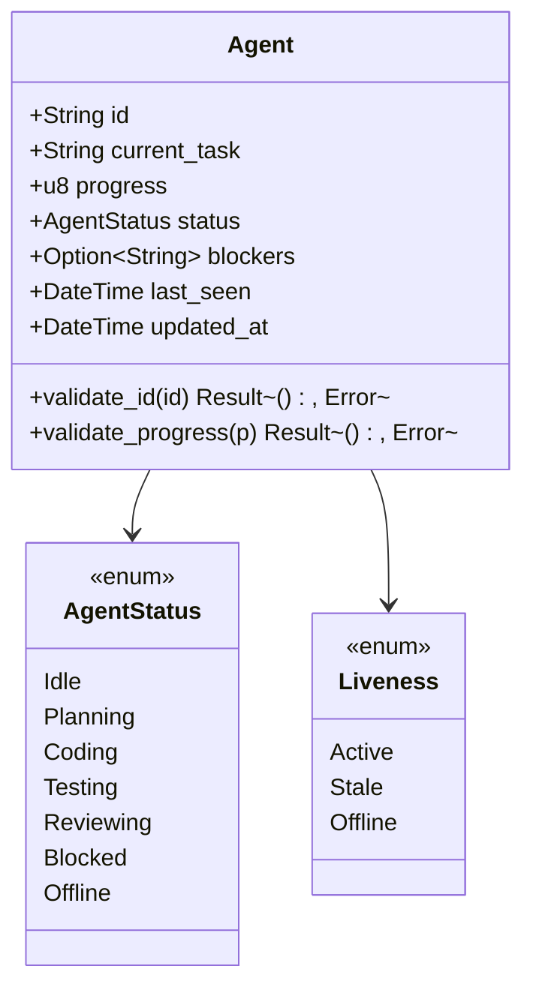
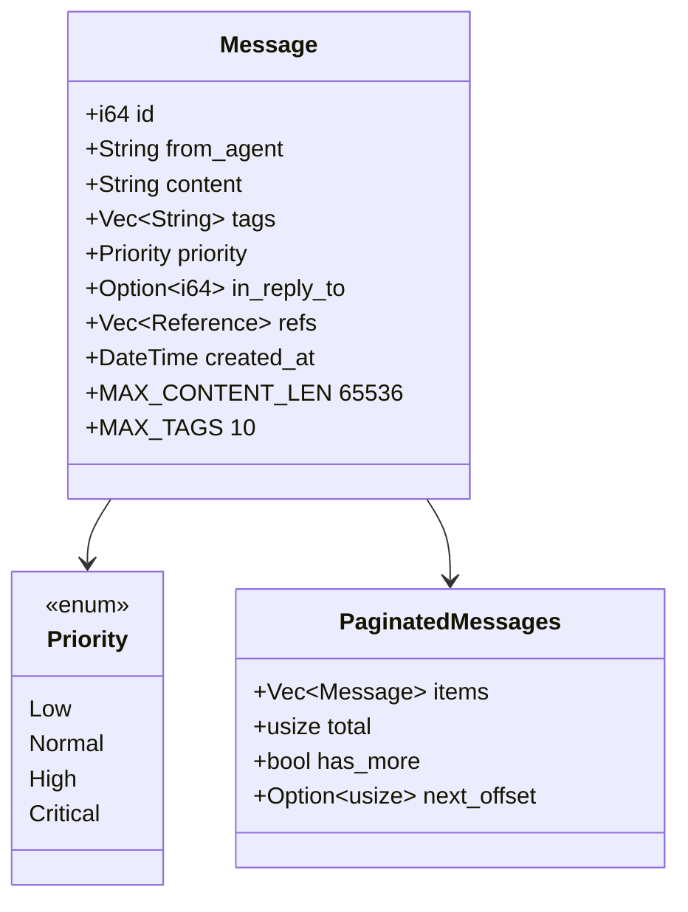
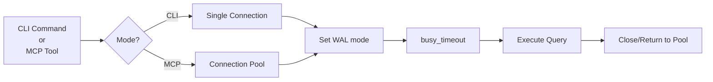

# Blackboard (`bb`) System Architecture

> **Note**: This document describes the full architecture as specified in [SPEC.md](./SPEC.md). The codebase is currently a shell project.

---

## 1. High-Level Architecture

Blackboard (`bb`) is a local, SQLite-backed coordination and knowledge surface for AI coding agents and humans. It follows a **dual-interface, shared-core** pattern where both CLI and MCP server invoke the same domain logic.



---

## 2. Critical Architecture Gaps & Fixes

### 2.1 Pagination Missing (FIXED)

**Gap**: Original design did not specify pagination for list operations. This would cause performance degradation with large datasets.

**Fix**: All list operations must support cursor-based pagination:

```rust
// src/core/models/pagination.rs
pub struct Pagination {
    pub limit: usize,      // Default: 20, Max: 100
    pub offset: usize,     // For offset-based pagination
}

pub struct PaginatedResult<T> {
    pub items: Vec<T>,
    pub total: usize,
    pub has_more: bool,
    pub next_offset: Option<usize>,
}
```

### 2.2 Database Connection Strategy (FIXED)

**Gap**: Original design suggested "open → transact → close" per operation. This is fine for CLI but inefficient for MCP server.

**Fix**: Connection pooling with proper lifecycle management:

```rust
// src/db/connection.rs
pub struct ConnectionPool {
    /// For CLI: single-use connections
    /// For MCP: r2d2 pool with max 5 connections
    inner: PoolType,
}

enum PoolType {
    Single(PathBuf),  // CLI mode
    Pooled(r2d2::Pool<SqliteConnectionManager>),  // MCP mode
}

/// Connection configuration constants
pub const DB_BUSY_TIMEOUT_MS: i64 = 5000;
pub const DB_MAX_CONNECTIONS: u32 = 5;
pub const DB_CONNECTION_TIMEOUT_SECS: u64 = 5;
```

### 2.3 Transaction Retry Logic (FIXED)

**Gap**: No retry strategy for DATABASE_BUSY errors.

**Fix**: Exponential backoff retry:

```rust
// src/db/transaction.rs
pub const TX_MAX_RETRIES: u32 = 3;
pub const TX_BASE_DELAY_MS: u64 = 10;

pub fn with_retry<F, T>(f: F) -> BBResult<T>
where
    F: Fn() -> BBResult<T>,
{
    let mut retries = 0;
    loop {
        match f() {
            Ok(v) => return Ok(v),
            Err(BBError::DatabaseBusy) if retries < TX_MAX_RETRIES => {
                retries += 1;
                let delay = TX_BASE_DELAY_MS * 2_u64.pow(retries);
                std::thread::sleep(Duration::from_millis(delay));
            }
            Err(e) => return Err(e),
        }
    }
}
```

### 2.4 Schema Migration Strategy (FIXED)

**Gap**: Original design had no migration strategy beyond a version number.

**Fix**: Full migration system with up/down scripts:

```rust
// src/db/migrations.rs
pub struct Migration {
    pub version: u32,
    pub name: &'static str,
    pub up: &'static str,
    pub down: &'static str,
}

pub const MIGRATIONS: &[Migration] = &[
    Migration {
        version: 1,
        name: "initial_schema",
        up: include_str!("../../migrations/001_initial.sql"),
        down: "",
    },
];

/// Migration state tracking
pub struct SchemaVersion {
    pub version: u32,
    pub applied_at: DateTime<Utc>,
    pub checksum: String,  // SHA256 of migration content
}
```

### 2.5 JSON Field Indexing (FIXED)

**Gap**: No indexes for JSON array queries (tags, refs filtering would be slow).

**Fix**: Generated columns with indexes:

```sql
-- In schema, add generated columns for common JSON queries
CREATE TABLE messages (
    id INTEGER PRIMARY KEY AUTOINCREMENT,
    from_agent TEXT NOT NULL,
    content TEXT NOT NULL,
    tags TEXT NOT NULL DEFAULT '[]' CHECK (json_valid(tags)),
    priority TEXT NOT NULL DEFAULT 'normal',
    in_reply_to INTEGER REFERENCES messages(id),
    refs TEXT NOT NULL DEFAULT '[]' CHECK (json_valid(refs)),
    created_at TIMESTAMP NOT NULL DEFAULT CURRENT_TIMESTAMP,
    
    -- Generated column for tag search optimization
    tags_search TEXT GENERATED ALWAYS AS (LOWER(tags)) STORED
);

-- Indexes for JSON queries
CREATE INDEX idx_messages_tags ON messages(tags_search) 
    WHERE tags != '[]';
CREATE INDEX idx_messages_refs ON messages(refs) 
    WHERE refs != '[]';

-- Full-text search for content (optional but recommended)
CREATE VIRTUAL TABLE messages_fts USING fts5(content, content=messages);
```

### 2.6 Input Size Limits (FIXED)

**Gap**: No size limits on text fields (content, blockers could be unlimited).

**Fix**: Validation constants:

```rust
// src/core/validation/limits.rs
pub const MAX_AGENT_ID_LEN: usize = 64;
pub const MAX_TASK_LEN: usize = 256;
pub const MAX_BLOCKERS_LEN: usize = 1024;
pub const MAX_MESSAGE_CONTENT_LEN: usize = 65536;  // 64KB
pub const MAX_ARTIFACT_PATH_LEN: usize = 4096;
pub const MAX_ARTIFACT_DESC_LEN: usize = 1024;
pub const MAX_VERSION_LEN: usize = 64;
pub const MAX_TAGS_PER_MESSAGE: usize = 10;
pub const MAX_REFS_PER_ENTITY: usize = 20;
pub const MAX_TAG_LEN: usize = 32;

/// Validate agent ID format
pub fn validate_agent_id(id: &str) -> BBResult<()> {
    if id.is_empty() {
        return Err(BBError::InvalidInput("Agent ID cannot be empty".to_string()));
    }
    if id.len() > MAX_AGENT_ID_LEN {
        return Err(BBError::InvalidInput(format!(
            "Agent ID too long: {} > {}",
            id.len(),
            MAX_AGENT_ID_LEN
        )));
    }
    // Reject control characters
    if id.chars().any(|c| c.is_control()) {
        return Err(BBError::InvalidInput(
            "Agent ID contains control characters".to_string()
        ));
    }
    Ok(())
}
```

### 2.7 Path Traversal Protection (FIXED)

**Gap**: No validation that artifact paths don't escape project directory.

**Fix**: Path canonicalization and validation:

```rust
// src/core/validation/path.rs
pub fn validate_artifact_path(path: &str, project_root: &Path) -> BBResult<PathBuf> {
    // Reject absolute paths
    if Path::new(path).is_absolute() {
        return Err(BBError::PathTraversal(path.to_string()));
    }
    
    // Reject path traversal attempts
    if path.contains("..") || path.starts_with('/') || path.starts_with('\\') {
        return Err(BBError::PathTraversal(path.to_string()));
    }
    
    // Canonicalize and verify it's within project
    let canonical = project_root.join(path).canonicalize()
        .map_err(|_| BBError::InvalidInput(format!("Invalid path: {}", path)))?;
    
    let project_canonical = project_root.canonicalize()?;
    
    if !canonical.starts_with(&project_canonical) {
        return Err(BBError::PathTraversal(path.to_string()));
    }
    
    Ok(canonical)
}
```

### 2.8 Liveness Update Race Condition (FIXED)

**Gap**: Side-effect read updates could cause contention and race conditions.

**Fix**: Optimistic locking with conditional updates:

```rust
// src/core/operations/agent.rs
/// Update liveness with optimistic concurrency control
pub fn update_liveness_optimistic(
    conn: &mut Connection,
    agent_id: &str,
    expected_last_seen: DateTime<Utc>,
) -> BBResult<()> {
    let tx = conn.transaction()?;
    
    // Only update if last_seen hasn't changed (no race)
    let updated = tx.execute(
        "UPDATE agents 
         SET status = 'offline',
             updated_at = ?
         WHERE id = ? 
           AND last_seen = ?
           AND status != 'offline'",
        (Utc::now(), agent_id, expected_last_seen),
    )?;
    
    tx.commit()?;
    
    if updated == 0 {
        // Agent was updated concurrently, not an error
        trace!("Liveness update raced for agent {}", agent_id);
    }
    
    Ok(())
}
```

### 2.9 MCP Rate Limiting (FIXED)

**Gap**: No rate limiting for MCP operations.

**Fix**: Token bucket rate limiter per agent:

```rust
// src/mcp/rate_limit.rs
pub struct RateLimiter {
    buckets: Arc<Mutex<HashMap<String, TokenBucket>>>,
    max_requests_per_minute: u32,
}

struct TokenBucket {
    tokens: f64,
    last_update: Instant,
}

impl RateLimiter {
    pub const DEFAULT_MAX_RPM: u32 = 60;  // 1 per second average
    
    pub fn check_rate(&self, agent_id: &str) -> BBResult<()> {
        let mut buckets = self.buckets.lock().unwrap();
        let bucket = buckets.entry(agent_id.to_string()).or_insert(TokenBucket {
            tokens: Self::DEFAULT_MAX_RPM as f64,
            last_update: Instant::now(),
        });
        
        // Replenish tokens
        let elapsed = bucket.last_update.elapsed().as_secs_f64();
        bucket.tokens = (bucket.tokens + elapsed * (self.max_requests_per_minute as f64 / 60.0))
            .min(self.max_requests_per_minute as f64);
        bucket.last_update = Instant::now();
        
        // Check if request can proceed
        if bucket.tokens >= 1.0 {
            bucket.tokens -= 1.0;
            Ok(())
        } else {
            Err(BBError::RateLimited)
        }
    }
}
```

### 2.10 WAL Checkpointing Strategy (FIXED)

**Gap**: No WAL checkpointing strategy mentioned.

**Fix**: Passive checkpointing with periodic forced checkpoints:

```rust
// src/db/maintenance.rs
pub const WAL_CHECKPOINT_THRESHOLD_PAGES: i32 = 1000;
pub const WAL_AUTO_CHECKPOINT_PAGES: i32 = 100;

/// Configure WAL and set up checkpointing
pub fn configure_wal(conn: &Connection) -> BBResult<()> {
    // Set auto-checkpoint threshold
    conn.execute_batch(&format!(
        "PRAGMA journal_mode = WAL;
         PRAGMA wal_autocheckpoint = {};
         PRAGMA busy_timeout = {};
         PRAGMA foreign_keys = ON;
         PRAGMA synchronous = NORMAL;",
        WAL_AUTO_CHECKPOINT_PAGES,
        DB_BUSY_TIMEOUT_MS
    ))?;
    Ok(())
}

/// Force checkpoint (call during maintenance)
pub fn checkpoint(conn: &Connection) -> BBResult<()> {
    conn.execute("PRAGMA wal_checkpoint(TRUNCATE)", [])?;
    Ok(())
}
```

---

## 3. Module Structure

Based on Section 14.3 of SPEC.md, with fixes applied:

```text
bb/
├── src/
│   ├── main.rs              # Entry point: CLI dispatch + MCP dispatch
│   ├── cli/                 # Clap commands and output formatting
│   │   ├── mod.rs
│   │   ├── commands/
│   │   │   ├── mod.rs
│   │   │   ├── init.rs      # bb init
│   │   │   ├── status.rs    # bb status, bb status set, bb status get
│   │   │   ├── message.rs   # bb log, bb post, bb message
│   │   │   ├── artifact.rs   # bb artifacts, bb artifact add/show
│   │   │   ├── ref.rs       # bb refs
│   │   │   ├── clear.rs     # bb clear
│   │   │   ├── export.rs    # bb export
│   │   │   ├── summary.rs   # bb summary
│   │   │   └── install.rs   # bb install
│   │   └── output.rs        # Table formatting, JSON formatting
│   │
│   ├── mcp/                 # rmcp server + tool handlers
│   │   ├── mod.rs
│   │   ├── server.rs        # MCP server initialization
│   │   ├── tools.rs         # Tool definitions (bb_identify, bb_set_status, etc.)
│   │   ├── identity.rs      # Identity resolution (--agent, BB_AGENT_ID, bb_identify)
│   │   └── rate_limit.rs    # Rate limiting per agent [NEW]
│   │
│   ├── core/                # Domain logic (shared by CLI and MCP)
│   │   ├── mod.rs
│   │   ├── models/          # Domain models
│   │   │   ├── mod.rs
│   │   │   ├── agent.rs     # Agent struct and status enum
│   │   │   ├── message.rs   # Message struct and priority enum
│   │   │   ├── artifact.rs  # Artifact struct
│   │   │   ├── reference.rs # Reference struct
│   │   │   └── pagination.rs # Pagination structs [NEW]
│   │   ├── operations/      # Business logic
│   │   │   ├── mod.rs
│   │   │   ├── agent.rs     # Agent CRUD, liveness detection
│   │   │   ├── message.rs   # Message posting, reading, filtering
│   │   │   ├── artifact.rs  # Artifact upsert, listing
│   │   │   └── reference.rs # Reference lookups
│   │   ├── validation/      # Input validation [ENHANCED]
│   │   │   ├── mod.rs
│   │   │   ├── ref.rs       # Reference format validation
│   │   │   ├── duration.rs  # Duration parsing (10m, 1h, 2d)
│   │   │   ├── limits.rs    # Size limits validation [NEW]
│   │   │   └── path.rs      # Path traversal protection [NEW]
│   │   └── errors.rs        # Error types (BBError enum) [ENHANCED]
│   │
│   ├── db/                  # SQLite connection, migrations, queries
│   │   ├── mod.rs
│   │   ├── connection.rs    # Connection pool + pragmas [ENHANCED]
│   │   ├── transaction.rs   # Transaction retry logic [NEW]
│   │   ├── migrations.rs    # Schema initialization [ENHANCED]
│   │   ├── maintenance.rs   # WAL checkpointing [NEW]
│   │   ├── queries/         # SQL queries
│   │   │   ├── mod.rs
│   │   │   ├── agent.rs     # Agent queries
│   │   │   ├── message.rs   # Message queries
│   │   │   └── artifact.rs  # Artifact queries
│   │   └── schema.rs        # Table definitions
│   │
│   └── util/                # Utilities
│       ├── mod.rs
│       ├── discovery.rs     # .bb/ directory discovery
│       ├── duration.rs      # Duration parsing
│       └── ref.rs           # Reference string parsing
│
├── migrations/              # Schema SQL [ENHANCED]
│   ├── 001_initial.sql
│   └── 002_add_fts.sql      # Optional full-text search
└── tests/                   # Integration tests
```

---

## 4. Core Data Models

All models live in `src/core/models/`:

### 4.1 Agent Model (FIXED)

**Gap**: Missing input validation for agent ID format and size.

**Fix**: Validation constants and methods added.



**Source location**: `src/core/models/agent.rs`

```rust
pub struct Agent {
    pub id: String,                    // PK, max 64 chars
    pub current_task: String,          // DEFAULT '', max 256 chars
    pub progress: u8,                  // 0-100, DEFAULT 0
    pub status: AgentStatus,           // DEFAULT 'idle'
    pub blockers: Option<String>,      // NULL unless status='blocked', max 1024 chars
    pub last_seen: DateTime<Utc>,      // DEFAULT CURRENT_TIMESTAMP
    pub updated_at: DateTime<Utc>,     // DEFAULT CURRENT_TIMESTAMP
}

impl Agent {
    pub const MAX_ID_LEN: usize = 64;
    pub const MAX_TASK_LEN: usize = 256;
    pub const MAX_BLOCKERS_LEN: usize = 1024;
    
    pub fn validate_id(id: &str) -> BBResult<()> {
        // Implementation: check empty, length, control chars
    }
}
```

### 4.2 Message Model (FIXED)

**Gap**: Missing size limits and pagination support.

**Fix**: Content limits and paginated queries.



### 4.3 Artifact Model (FIXED)

**Gap**: Missing path traversal protection.

**Fix**: Path validation in operations layer.

### 4.4 Reference Model (FIXED)

**Gap**: Missing ref value size limits.

**Fix**: Max ref length of 256 chars.

---

## 5. Database Layer (ENHANCED)

**Source location**: `src/db/`

### 5.1 Connection Management (FIXED)



### 5.2 Schema (FIXED)

**Gap**: No JSON indexes, no FTS, no generated columns.

**Fix**: Optimized schema with indexes:

```sql
-- Schema with performance optimizations
PRAGMA journal_mode = WAL;
PRAGMA busy_timeout = 5000;
PRAGMA foreign_keys = ON;
PRAGMA synchronous = NORMAL;

CREATE TABLE schema_version (
    version INTEGER NOT NULL PRIMARY KEY,
    applied_at TIMESTAMP NOT NULL DEFAULT CURRENT_TIMESTAMP,
    checksum TEXT NOT NULL
);

CREATE TABLE agents (
    id TEXT PRIMARY KEY,
    current_task TEXT NOT NULL DEFAULT '',
    progress INTEGER NOT NULL DEFAULT 0
        CHECK (progress >= 0 AND progress <= 100),
    status TEXT NOT NULL DEFAULT 'idle'
        CHECK (status IN ('idle', 'planning', 'coding', 'testing', 'reviewing', 'blocked', 'offline')),
    blockers TEXT
        CHECK (blockers IS NULL OR LENGTH(blockers) <= 1024),
    last_seen TIMESTAMP NOT NULL DEFAULT CURRENT_TIMESTAMP,
    updated_at TIMESTAMP NOT NULL DEFAULT CURRENT_TIMESTAMP,
    CHECK (LENGTH(id) <= 64),
    CHECK (LENGTH(current_task) <= 256)
);

CREATE TABLE messages (
    id INTEGER PRIMARY KEY AUTOINCREMENT,
    from_agent TEXT NOT NULL
        CHECK (LENGTH(from_agent) <= 64),
    content TEXT NOT NULL
        CHECK (LENGTH(content) <= 65536),
    tags TEXT NOT NULL DEFAULT '[]'
        CHECK (json_valid(tags)),
    priority TEXT NOT NULL DEFAULT 'normal'
        CHECK (priority IN ('low', 'normal', 'high', 'critical')),
    in_reply_to INTEGER REFERENCES messages(id),
    refs TEXT NOT NULL DEFAULT '[]'
        CHECK (json_valid(refs)),
    created_at TIMESTAMP NOT NULL DEFAULT CURRENT_TIMESTAMP,
    -- Generated column for tag search optimization
    tags_search TEXT GENERATED ALWAYS AS (LOWER(tags)) STORED
);

CREATE TABLE artifacts (
    id INTEGER PRIMARY KEY AUTOINCREMENT,
    path TEXT NOT NULL UNIQUE
        CHECK (LENGTH(path) <= 4096),
    produced_by TEXT NOT NULL
        CHECK (LENGTH(produced_by) <= 64),
    description TEXT NOT NULL DEFAULT ''
        CHECK (LENGTH(description) <= 1024),
    version TEXT
        CHECK (version IS NULL OR LENGTH(version) <= 64),
    refs TEXT NOT NULL DEFAULT '[]'
        CHECK (json_valid(refs)),
    created_at TIMESTAMP NOT NULL DEFAULT CURRENT_TIMESTAMP
);

-- Optimized indexes
CREATE INDEX idx_agents_status ON agents(status);
CREATE INDEX idx_agents_last_seen ON agents(last_seen);

CREATE INDEX idx_messages_created_at ON messages(created_at DESC);
CREATE INDEX idx_messages_from_agent ON messages(from_agent);
CREATE INDEX idx_messages_priority ON messages(priority) WHERE priority IN ('high', 'critical');
CREATE INDEX idx_messages_in_reply_to ON messages(in_reply_to) WHERE in_reply_to IS NOT NULL;
CREATE INDEX idx_messages_tags ON messages(tags_search) WHERE tags != '[]';

CREATE INDEX idx_artifacts_path ON artifacts(path);
CREATE INDEX idx_artifacts_produced_by ON artifacts(produced_by);
CREATE INDEX idx_artifacts_created_at ON artifacts(created_at DESC);
```

### 5.3 Transaction Retry (NEW)

**Gap**: No handling of SQLITE_BUSY beyond timeout.

**Fix**: Exponential backoff retry with jitter.

---

## 6. Core Operations (Business Logic)

### 6.1 Agent Operations (FIXED)

**Gap**: Race condition in liveness updates.

**Fix**: Optimistic concurrency control.

### 6.2 Message Operations (FIXED)

**Gap**: No pagination, no size limits.

**Fix**: Paginated queries with limits.

### 6.3 Artifact Operations (FIXED)

**Gap**: No path traversal protection.

**Fix**: Path validation before storage.

---

## 7. CLI Module

### 7.1 Command Structure

**Gap**: No mention of pagination CLI options.

**Fix**: Add pagination flags:

```rust
pub struct ListCommands {
    // ... existing filters ...
    
    /// Maximum number of results (default: 20, max: 100)
    #[arg(long, default_value = "20")]
    pub limit: usize,
    
    /// Offset for pagination
    #[arg(long, default_value = "0")]
    pub offset: usize,
}
```

---

## 8. MCP Server Module (ENHANCED)

### 8.1 Rate Limiting (NEW)

Added per-agent rate limiting to prevent abuse.

### 8.2 Graceful Shutdown (NEW)

**Gap**: No graceful shutdown handling.

**Fix**: Signal handling for clean shutdown.

```rust
// src/mcp/server.rs
pub async fn run_mcp_server(args: McpArgs) -> BBResult<()> {
    // Set up shutdown signal handler
    let shutdown = tokio::spawn(async move {
        tokio::signal::ctrl_c().await.ok();
        info!("Received shutdown signal, finishing pending requests...");
    });
    
    // ... server logic ...
    
    // Wait for graceful shutdown or force after timeout
    tokio::select! {
        _ = shutdown => {
            info!("Graceful shutdown complete");
        }
        _ = tokio::time::sleep(Duration::from_secs(5)) => {
            warn!("Forced shutdown after timeout");
        }
    }
    
    Ok(())
}
```

---

## 9. Error Handling (ENHANCED)

**Gap**: Error types were basic, no structured errors for MCP.

**Fix**: Comprehensive error hierarchy with retry hints:

```rust
pub enum BBError {
    // ... existing errors ...
    
    /// Indicates if error is retryable
    retryable: bool,
}

impl BBError {
    /// Check if this error is transient and the operation should be retried
    pub fn is_retryable(&self) -> bool {
        matches!(self, 
            Self::DatabaseBusy | 
            Self::ConcurrentModification |
            Self::TransactionError(_)
        )
    }
    
    /// Get recommended retry delay
    pub fn retry_delay(&self, attempt: u32) -> Duration {
        match self {
            Self::DatabaseBusy => Duration::from_millis(10 * 2_u64.pow(attempt)),
            _ => Duration::from_millis(100 * 2_u64.pow(attempt)),
        }
    }
}
```

---

## 10. Testing Strategy (ENHANCED)

### 10.1 Additional Test Categories (NEW)

| Category | Description |
|----------|-------------|
| Concurrency | Spawn 10+ threads, verify WAL handles contention |
| Rate Limiting | Verify 61st request in a minute is rejected |
| Path Traversal | Attempt `../../../etc/passwd`, verify rejection |
| Size Limits | Verify content > 64KB is rejected |
| Pagination | Verify offset/limit works correctly |
| Migration | Test upgrade from v1 to v2 schema |

---

## 11. Performance Considerations (NEW)

### 11.1 Query Optimization

```rust
// Use covering indexes where possible
const AGENT_LIST_COVERING: &str = "
    SELECT id, current_task, progress, status, blockers, last_seen, updated_at
    FROM agents
    ORDER BY last_seen DESC
";

// For large message tables, use keyset pagination instead of OFFSET
const MESSAGE_KEYSET_PAGINATION: &str = "
    SELECT * FROM messages
    WHERE created_at < ?
    ORDER BY created_at DESC
    LIMIT ?
";
```

### 11.2 Caching Strategy

**Gap**: No caching mentioned.

**Fix**: LRU cache for frequently accessed data:

```rust
// Cache agent lookups (they change frequently but are read often)
pub struct AgentCache {
    cache: Arc<RwLock<LruCache<String, Agent>>>,
}

impl AgentCache {
    pub const CACHE_SIZE: usize = 100;
    pub const TTL_SECS: u64 = 30;  // Short TTL for liveness
}
```

---

## 12. Security Considerations (NEW)

### 12.1 Threat Model

| Threat | Mitigation |
|--------|------------|
| Path traversal | Canonicalize paths, check prefix |
| DoS via large input | Size limits on all text fields |
| DoS via rate | Rate limiting per agent |
| SQL injection | Use parameterized queries exclusively |
| Resource exhaustion | Pagination, connection pooling |

### 12.2 Input Sanitization

All user inputs validated at API boundary before reaching database:

```rust
// Validation happens in this order:
// 1. CLI/MCP layer: Parse and basic validation
// 2. Validation layer: Business rule validation (sizes, formats)
// 3. Database layer: Schema constraints (last resort)
```

---

## 13. Operational Considerations (NEW)

### 13.1 Health Check

```rust
pub fn health_check(conn: &Connection) -> BBResult<HealthStatus> {
    // 1. Check database is writable
    // 2. Check WAL size (alert if > 100MB)
    // 3. Check table sizes
    // 4. Return status
}
```

### 13.2 Maintenance Operations

```rust
// src/db/maintenance.rs
pub fn vacuum_if_needed(conn: &Connection) -> BBResult<()> {
    // Run VACUUM if fragmentation > 20%
}

pub fn analyze(conn: &Connection) -> BBResult<()> {
    // Update query planner statistics
}
```

---

## 14. Summary of Fixes

| Issue | Severity | Fix |
|-------|----------|-----|
| No pagination | High | Added `PaginatedResult<T>` with limit/offset |
| No connection pooling | Medium | Added `ConnectionPool` with r2d2 for MCP |
| No transaction retry | High | Added exponential backoff retry |
| No migrations | Medium | Added migration system with checksums |
| No JSON indexes | Medium | Added generated columns + partial indexes |
| No size limits | High | Added validation constants |
| No path traversal protection | High | Added `validate_artifact_path()` |
| Liveness race condition | Medium | Added optimistic concurrency control |
| No rate limiting | Medium | Added token bucket rate limiter |
| No WAL checkpointing | Low | Added checkpoint configuration |
| Error types incomplete | Medium | Added `is_retryable()` and structured errors |
| No graceful shutdown | Medium | Added signal handling for MCP |
| No health checks | Low | Added `health_check()` function |

---

## 15. Key Principles (Reinforced)

1. **Dual Interface, Shared Core**: Both CLI and MCP invoke the same `core::operations` functions
2. **SQLite with WAL**: Persistent, concurrent-accessible storage with proper checkpointing
3. **Identity Resolution**: Precedence `--agent` > `BB_AGENT_ID` > `bb_identify`
4. **Append-Only Messages**: No edits, no deletes (except bulk cleanup)
5. **Artifact Upserts**: Keyed by path, updates on re-registration
6. **Liveness Detection**: Side-effect updates with optimistic concurrency control
7. **Structured References**: Cross-tool linking without foreign key enforcement
8. **Defense in Depth**: Validation at API boundary, database constraints as backup
9. **Fail Fast**: Retryable errors use exponential backoff, permanent errors fail immediately
10. **Observability**: Health checks, metrics, and structured logging throughout

This architecture enables multiple AI agents to coordinate effectively while maintaining robustness, performance, and correctness guarantees.
