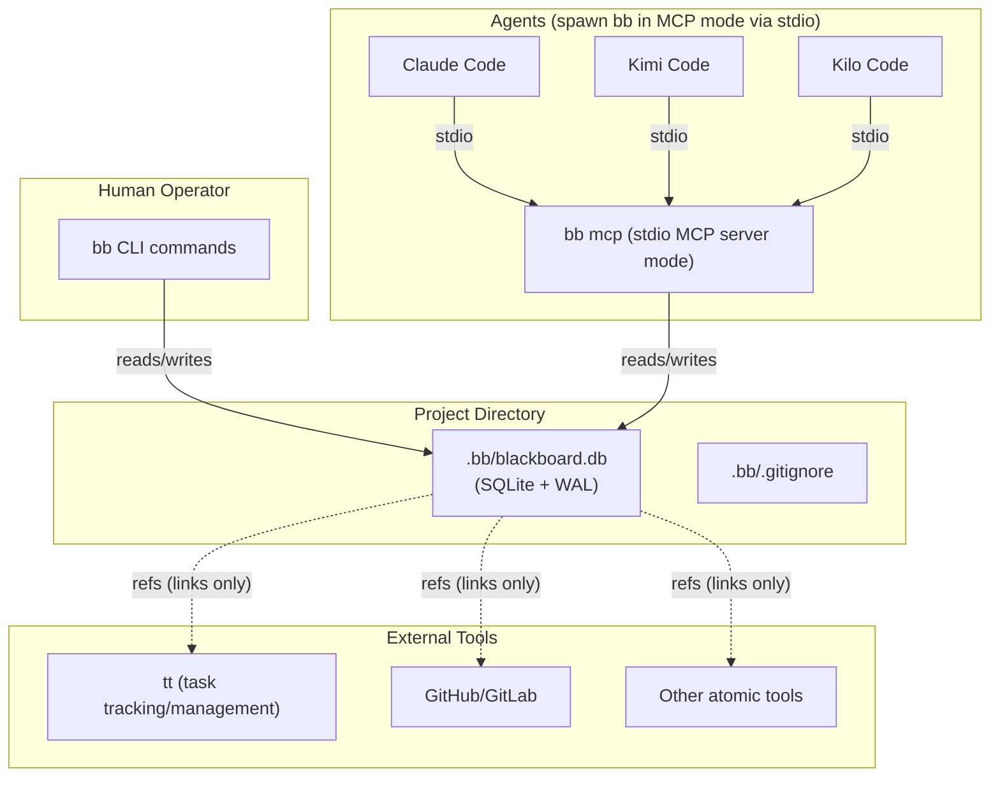
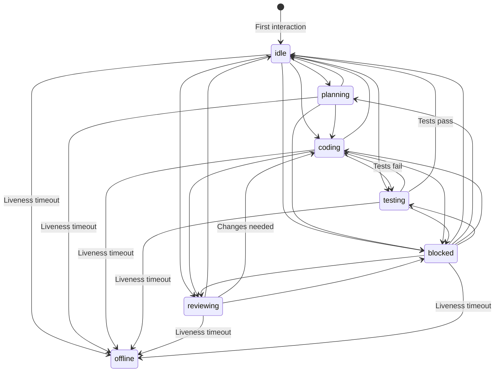
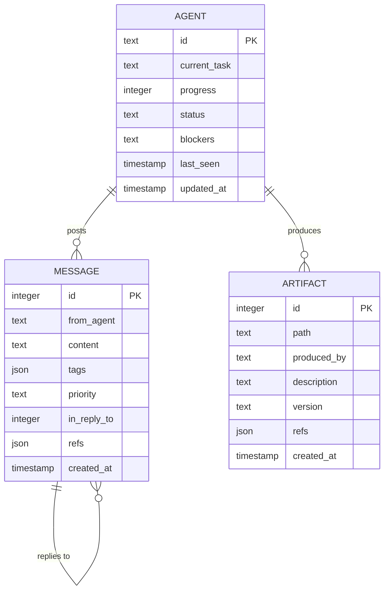
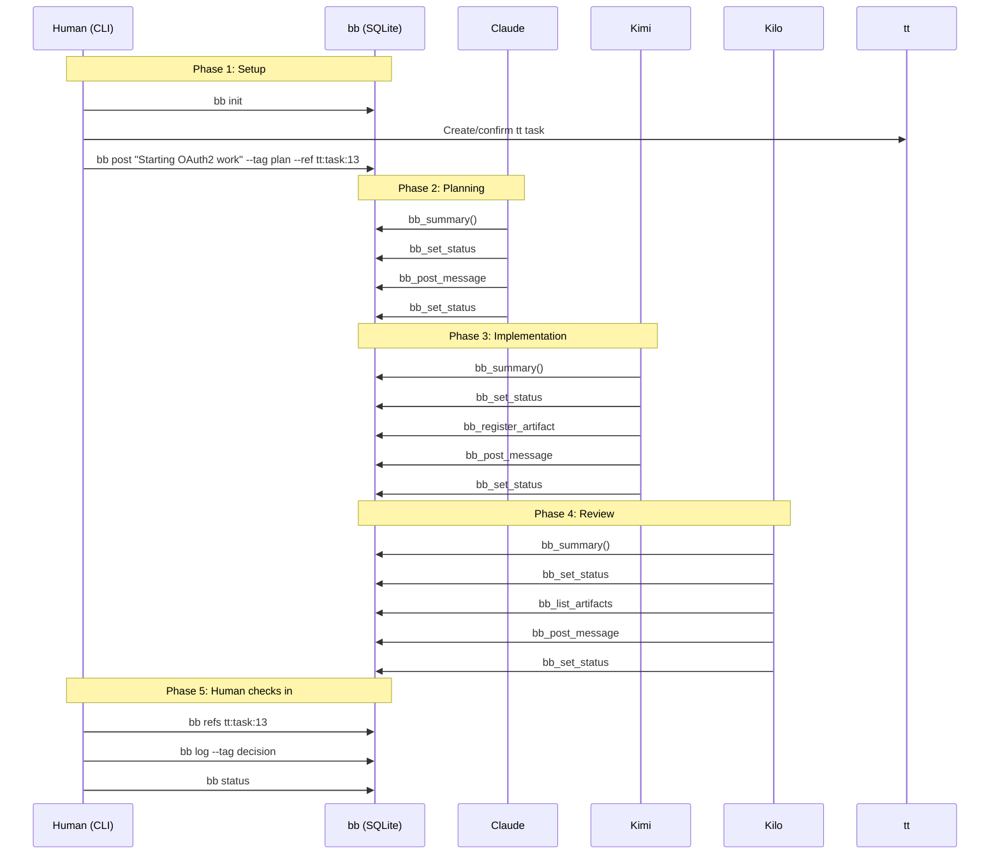
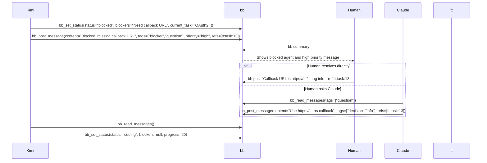
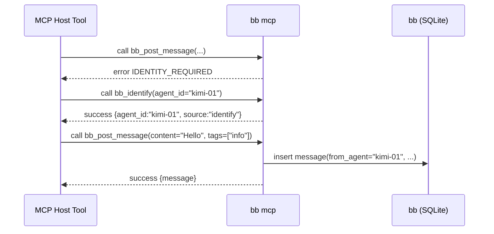

# Blackboard (`bb`) — System Specification

*Last Updated: 2026-02-19*  
*Tool: `bb` (single binary)*  
*Modes: CLI (default), MCP server (`bb mcp` / `bb --mcp`)*  
*Storage: SQLite (WAL mode, file-based, local)*  
*Scope: coordination + messaging + artifact registry + cross-tool references; **not** task tracking*

---

## 1. Overview

### 1.1 What Is Blackboard?

Blackboard (`bb`) is a **local, SQLite-backed coordination and knowledge surface** for multiple AI coding agents and humans working in the same project directory.

It provides:

- **Presence awareness**: who is active, what they’re doing, whether they’re blocked
- **Structured communication**: append-only, tagged, prioritized messages (optionally threaded)
- **Artifact registry**: a lightweight “who produced this file and why” catalog
- **Cross-tool linking**: structured **references** that connect `bb` entries to external tools (e.g., `tt`) while keeping each tool single-purpose

Blackboard is **not** a task tracker. Task tracking / management belongs in external tools such as `tt`. Blackboard’s role is to coordinate agents locally and preserve high-signal collaboration context.

### 1.2 Why Does It Exist?

Multiple coding agents running in parallel (e.g., Claude Code, Kimi Code, Kilo Code) share a filesystem but otherwise operate independently. Without a shared surface, they duplicate work, miss decisions, and have poor visibility into blockers. Markdown logs are ad-hoc and not queryable.

Blackboard solves this with a **durable, queryable, local** store.

### 1.3 Design Principles

| Principle | Rationale |
|---|---|
| **Pull, not push** | Agents cannot receive interrupts; they poll when ready. |
| **Persistence over presence** | No sessions, sockets, or daemons; SQLite stores durable state. |
| **Structured over freeform** | Enums, tags, priorities, and references enable robust filtering and automation. |
| **Local and portable** | `.bb/` directory only; no network services. |
| **Single binary** | One tool `bb`: CLI by default; MCP mode via `bb mcp` (or `bb --mcp`). |
| **Dual interface, shared core** | CLI and MCP expose the same operations and validation. |
| **Append-only messages** | Prevent missed updates and inconsistent agent reads. |
| **Composable ecosystem** | References link to external single-purpose tools (e.g., `tt`). |

### 1.4 Pattern

Implements the [Blackboard Design Pattern](https://en.wikipedia.org/wiki/Blackboard_(design_pattern)): independent agents cooperate via a shared knowledge store.

---

## 2. Architecture

### 2.1 Components

**Storage (SQLite)**
- File: `.bb/blackboard.db`
- WAL enabled for concurrency
- `busy_timeout` configured for transient locks

**`bb` Binary**
- CLI subcommands (human-facing)
- MCP server mode over stdio (agent-facing)
- Shared core library for DB access + validation

### 2.2 System Context (Mermaid)



### 2.3 Directory Structure

```text
project/
├── .bb/
│   ├── blackboard.db
│   ├── blackboard.db-wal
│   ├── blackboard.db-shm
│   └── .gitignore          # contains "*"
└── ...
```

### 2.4 Platform Support

| Platform | Status | Notes |
|---|---|---|
| Linux (x86_64) | Primary | main development/testing |
| macOS (ARM/x86_64) | Supported | full functionality |
| Windows / WSL | Not targeted | may work in WSL but not guaranteed |

---

## 3. Initialization & Discovery

### 3.1 `bb init`

Creates `.bb/`, initializes SQLite schema (Section 6), writes `.bb/.gitignore` containing `*`.

**Behavior**
- `.bb/` exists + valid DB: no-op (prints confirmation)
- `.bb/` exists but DB missing/corrupt: recreate DB, warn
- `.bb/` absent: create directory + DB + `.gitignore`

### 3.2 Directory Discovery (git-style)

All `bb` operations (CLI and MCP) locate the board by searching for `.bb/` starting at CWD and walking up to filesystem root.

If not found: error  
`No blackboard found. Run 'bb init' to create one.`

### 3.3 No Auto-Initialization in MCP Mode

If `bb mcp` starts and no `.bb/` is found, it MUST return an MCP error indicating initialization is required. Only `bb init` creates the board (human opt-in).

---

## 4. Concepts & Entities

Blackboard stores **three** core entity types:

1. **Agents** (presence/status)
2. **Messages** (append-only communication log)
3. **Artifacts** (file registry)

Task tracking is explicitly external (e.g., `tt`). Blackboard links to external tasks using **references**.

### 4.1 Agents

An agent is any participant that reads/writes the blackboard.

- Agent ID: unique string (e.g., `claude-01`, `kimi-01`, `kilo-01`, `human`)
- CLI defaults to `human` and can override via `--as <agent_id>`
- MCP mode uses the identity mechanism defined in Section 7.2.2

Agents are implicitly created on first write.

**Agent fields**

| Field | Type | Purpose |
|---|---|---|
| `id` | text PK | unique identifier |
| `current_task` | text | free-text description of what the agent is doing (may include external refs in prose) |
| `progress` | integer 0–100 | rough completion estimate |
| `status` | enum | `idle`, `planning`, `coding`, `testing`, `reviewing`, `blocked`, `offline` |
| `blockers` | text nullable | only meaningful when `status='blocked'` |
| `last_seen` | timestamp | updated on every write by this agent |
| `updated_at` | timestamp | last time any agent field was changed |

### 4.2 Messages (Append-only)

Messages are the primary communication mechanism. Messages are never edited—only appended.

**Message fields**

| Field | Type | Purpose |
|---|---|---|
| `id` | integer PK | autoincrement total ordering |
| `from_agent` | text | sender agent ID |
| `content` | text | message body |
| `tags` | JSON array | string tags (filterable) |
| `priority` | enum | `low`, `normal`, `high`, `critical` |
| `in_reply_to` | integer nullable | message ID being replied to (threading) |
| `refs` | JSON array | structured references (Section 4.4) |
| `created_at` | timestamp | creation time |

**Standard tags** (convention): `decision`, `handoff`, `blocker`, `question`, `plan`, `review`, `info`.

### 4.3 Artifacts (File Registry)

Artifacts record file-level outputs in a structured way.

**Artifact fields**

| Field | Type | Purpose |
|---|---|---|
| `id` | integer PK | autoincrement |
| `path` | text unique | relative path from project root |
| `produced_by` | text | agent ID |
| `description` | text | what this file is / why it exists |
| `version` | text nullable | git SHA or version string |
| `refs` | JSON array | structured references (Section 4.4) |
| `created_at` | timestamp | registration time (updated on upsert) |

### 4.4 References (Cross-tool links)

References link blackboard information to external tools (e.g., `tt`) or internal entities.

**Reference object schema**

```json
{
  "where": "<tool_identifier>",
  "what": "<entity_type>",
  "ref": "<identifier>"
}
```

Example (external):

```json
{ "what": "task", "where": "tt", "ref": 13 }
```

**Field rules**
- `where`: non-empty string identifying a tool/system (e.g., `tt`, `github`, `bb`)
- `what`: non-empty string describing entity type (e.g., `task`, `issue`, `pr`, `doc`, `message`, `artifact`)
- `ref`: non-empty string or positive integer identifier in that system

**Internal references**
- Use `where: "bb"`
- Common patterns:
  - `{ "where": "bb", "what": "message", "ref": 7 }`
  - `{ "where": "bb", "what": "artifact", "ref": "src/auth/jwt.ts" }`

**Important**: `bb` does **not** validate that external references exist; references are links, not enforced foreign keys.

---

## 5. State Machines & Rules

### 5.1 Agent Status Transitions (Mermaid)

Agents may set any active status. `offline` is derived via liveness logic (Section 8.1).



Rules:
- Any status write updates `updated_at`
- Any write updates `last_seen`
- Setting status != `blocked` clears `blockers` to `NULL`

### 5.2 Message Immutability

- No message edits
- No per-message deletion
- Cleanup is bulk-only via `bb clear --messages-before ...`

### 5.3 Artifact Upsert Rules

Artifacts are keyed by `path`. Re-registering the same `path` updates:
- `produced_by`, `description`, `version`, `refs`, and `created_at`

---

## 6. Data Model

### 6.1 ER Diagram (Mermaid)



### 6.2 SQL Schema (SQLite)

```sql
PRAGMA journal_mode = WAL;
PRAGMA busy_timeout = 5000;
PRAGMA foreign_keys = ON;

CREATE TABLE schema_version (
    version INTEGER NOT NULL
);
INSERT INTO schema_version (version) VALUES (1);

CREATE TABLE agents (
    id TEXT PRIMARY KEY,
    current_task TEXT NOT NULL DEFAULT '',
    progress INTEGER NOT NULL DEFAULT 0
        CHECK (progress >= 0 AND progress <= 100),
    status TEXT NOT NULL DEFAULT 'idle'
        CHECK (status IN (
            'idle', 'planning', 'coding', 'testing',
            'reviewing', 'blocked', 'offline'
        )),
    blockers TEXT,
    last_seen TIMESTAMP NOT NULL DEFAULT CURRENT_TIMESTAMP,
    updated_at TIMESTAMP NOT NULL DEFAULT CURRENT_TIMESTAMP
);

CREATE TABLE messages (
    id INTEGER PRIMARY KEY AUTOINCREMENT,
    from_agent TEXT NOT NULL,
    content TEXT NOT NULL,
    tags TEXT NOT NULL DEFAULT '[]'
        CHECK (json_valid(tags)),
    priority TEXT NOT NULL DEFAULT 'normal'
        CHECK (priority IN ('low', 'normal', 'high', 'critical')),
    in_reply_to INTEGER REFERENCES messages(id),
    refs TEXT NOT NULL DEFAULT '[]'
        CHECK (json_valid(refs)),
    created_at TIMESTAMP NOT NULL DEFAULT CURRENT_TIMESTAMP
);

CREATE TABLE artifacts (
    id INTEGER PRIMARY KEY AUTOINCREMENT,
    path TEXT NOT NULL UNIQUE,
    produced_by TEXT NOT NULL,
    description TEXT NOT NULL DEFAULT '',
    version TEXT,
    refs TEXT NOT NULL DEFAULT '[]'
        CHECK (json_valid(refs)),
    created_at TIMESTAMP NOT NULL DEFAULT CURRENT_TIMESTAMP
);

CREATE INDEX idx_agents_status ON agents(status);

CREATE INDEX idx_messages_created_at ON messages(created_at DESC);
CREATE INDEX idx_messages_from_agent ON messages(from_agent);
CREATE INDEX idx_messages_in_reply_to ON messages(in_reply_to)
    WHERE in_reply_to IS NOT NULL;

CREATE INDEX idx_artifacts_path ON artifacts(path);
CREATE INDEX idx_artifacts_produced_by ON artifacts(produced_by);
```

---

## 7. Interface Specification

## 7.1 CLI Commands

All CLI commands:
- require initialization
- discover `.bb/` unless `--dir` is used
- default identity `human` (override via `--as`)

### 7.1.1 Initialization & Setup

| Command | Description |
|---|---|
| `bb init` | Create `.bb/` and initialize DB |
| `bb install [claude\|kimi\|kilo]` | Print MCP installation instructions and config snippets |
| `bb destroy --confirm` | Remove `.bb/` directory entirely |

### 7.1.2 Status (Presence)

| Command | Description |
|---|---|
| `bb status` | Table of all agents: id, status, current task, progress, blockers, last seen; stale/offline flagged |
| `bb status set "<task>" [options]` | Set calling agent’s status fields |
| `bb status get <agent_id>` | Detailed status for one agent |
| `bb status clear` | Reset to idle, empty task, progress=0 |

`bb status set` options:
- `--progress <0-100>`
- `--status <idle|planning|coding|testing|reviewing|blocked>`
- `--blockers "<text>"`

### 7.1.3 Messages

| Command | Description |
|---|---|
| `bb log` | Show recent messages (default last 20) |
| `bb post "<content>"` | Post a message |
| `bb message <id>` | Show one message + its replies (thread) |

`bb log` options:
- `--since <duration>` (e.g., `10m`, `1h`, `2d`)
- `--tag <tag>` (repeatable; OR semantics)
- `--from <agent_id>`
- `--priority <low|normal|high|critical>` (minimum priority)
- `--ref <where:what:ref>` (filter by references)
- `--limit <n>`

`bb post` options:
- `--tag <tag>` (repeatable)
- `--priority <low|normal|high|critical>`
- `--reply-to <message_id>`
- `--ref <where:what:ref>` (repeatable; attaches refs)

**`--ref` format**: `<where>:<what>:<ref>`

### 7.1.4 Artifacts

| Command | Description |
|---|---|
| `bb artifacts` | List artifacts |
| `bb artifact add "<path>" "<description>"` | Upsert artifact |
| `bb artifact show "<path>"` | Show artifact details |

`bb artifacts` options:
- `--by <agent_id>`
- `--ref <where:what:ref>`

`bb artifact add` options:
- `--version "<string>"`
- `--ref <where:what:ref>` (repeatable)

### 7.1.5 Reference Lookup (Cross-tool glue)

| Command | Description |
|---|---|
| `bb refs <where:what:ref>` | Find all messages and artifacts that reference a target |

### 7.1.6 Maintenance

| Command | Description |
|---|---|
| `bb clear [options]` | Bulk cleanup (messages older than…, remove offline agents, optional artifact clearing) |
| `bb export` | Dump full board state as JSON |
| `bb summary` | Compact overview (agents by status, blockers, recent messages, recent artifacts, high-priority items) |

`bb clear` options:
- `--messages-before <duration>`
- `--reset-offline`
- `--artifacts` (clear artifact registry; requires confirmation prompt unless `--confirm` exists)
- Without options: print counts and prompt for actions

### 7.1.7 Global CLI Options

| Option | Description |
|---|---|
| `--as <agent_id>` | Agent identity (default `human`) |
| `--json` | JSON output |
| `--dir <path>` | Explicit project directory |
| `--quiet` | Suppress non-essential output |

---

## 7.2 MCP Mode (stdio) — `bb mcp` / `bb --mcp`

### 7.2.1 MCP Mode

`bb mcp` runs the MCP server over stdio. Agent tools spawn it as a subprocess.

### 7.2.2 MCP Identity (Normative)

#### 7.2.2.1 Identity Sources

The MCP server MUST support these identity sources:

1. CLI argument: `bb mcp --agent <agent_id>`
2. Environment variable: `BB_AGENT_ID`
3. MCP handshake tool: `bb_identify(agent_id)`

#### 7.2.2.2 Precedence

Identity MUST resolve in this order:

1. `--agent`
2. `BB_AGENT_ID`
3. `bb_identify`

Lower-precedence mechanisms MUST NOT override a higher-precedence resolved identity.

#### 7.2.2.3 Missing Identity Behavior

If a tool invocation requires identity and no identity is resolved, the server MUST return:

- `code`: `IDENTITY_REQUIRED`
- `message`: instruct caller to configure `--agent`, set `BB_AGENT_ID`, or call `bb_identify`

Read-only operations MAY be allowed without identity (implementation choice). Any write of agent-attributed data MUST require identity.

#### 7.2.2.4 `bb_identify` Semantics

- Accepts `agent_id` (non-empty string).
- If identity fixed by `--agent`: MUST fail with `INVALID_INPUT`.
- If identity resolved from `BB_AGENT_ID`: SHOULD be rejected; MAY succeed only if same value; changing MUST be rejected.
- If identity not resolved: MUST set identity for lifetime of MCP server process.
- Subsequent calls:
  - same id: MUST succeed as no-op
  - different id: MUST fail with `INVALID_INPUT`

#### 7.2.2.5 Identity Format

- MUST be non-empty after trimming whitespace.
- SHOULD reject control characters.
- RECOMMENDED: `claude-01`, `kimi-01`, `kilo-01`, `human`.

### 7.2.3 MCP Environment

- `BB_AGENT_ID` (optional)
- `BB_DIR` (optional): explicit project directory; if set, MUST override discovery.

### 7.2.4 MCP Tools

| Tool Name | Description |
|---|---|
| `bb_identify` | Establish agent identity for this MCP process |
| `bb_set_status` | Update agent status fields |
| `bb_get_status` | Get one agent or all agents (with liveness annotations) |
| `bb_post_message` | Post a message (tags, priority, reply, refs) |
| `bb_read_messages` | Read messages with filters (since/tags/from/priority/refs) |
| `bb_register_artifact` | Upsert artifact (refs supported) |
| `bb_list_artifacts` | List artifacts with filters (produced_by/refs) |
| `bb_find_refs` | Find messages/artifacts referencing a strict target triple |
| `bb_summary` | Compact overview |

Write tools MUST update `last_seen`.

### 7.2.5 MCP Tool Definitions

(Identical to v2.6; omitted here for brevity is not allowed—so included.)

#### `bb_identify`
- Params: `agent_id` (string, required)
- Returns: `{ agent_id, source }` where `source` is one of `arg|env|identify`

#### `bb_set_status`
- Params: `current_task?`, `progress?`, `status?`, `blockers?`
- Returns: updated agent record
- Requires identity

#### `bb_get_status`
- Params: `agent_id?`
- Returns: agent(s) with `liveness` and `minutes_since_last_seen`

#### `bb_post_message`
- Params: `content` (required), `tags?`, `priority?`, `in_reply_to?`, `refs?`
- Returns: created message record
- Requires identity

#### `bb_read_messages`
- Params: `since?`, `tags?`, `from_agent?`, `priority?`, `ref_where?`, `ref_what?`, `ref_ref?`, `limit?`
- Returns: messages ordered by `created_at` ascending

#### `bb_register_artifact`
- Params: `path` (required), `description` (required), `version?`, `refs?`
- Returns: created/updated artifact record
- Requires identity; upsert by path

#### `bb_list_artifacts`
- Params: `produced_by?`, `ref_where?`, `ref_what?`, `ref_ref?`, `limit?`
- Returns: artifacts (recommended newest-first)

#### `bb_find_refs`
- Params: `where` (required), `what` (required), `ref` (required)
- Returns: `{ messages: [...], artifacts: [...] }`

#### `bb_summary`
- Params: none
- Returns: `agents`, `blocked_agents`, `recent_messages`, `high_priority_messages`, `recent_artifacts`

### 7.2.6 MCP Response Envelope

Success:
```json
{ "success": true, "data": {} }
```

Error:
```json
{
  "success": false,
  "error": { "code": "NOT_INITIALIZED", "message": "...", "details": {} }
}
```

---

## 8. Algorithms & Logic

### 8.1 Liveness Detection

Thresholds:
- <= 5 minutes: Active
- 5–30 minutes: Stale
- > 30 minutes: Offline

On reads returning agents (`bb status`, `bb_get_status`, `bb_summary`), agents beyond 30 minutes MUST be updated to `status='offline'` (side-effect read). Any write updates `last_seen`.

### 8.2 Concurrency

SQLite WAL supports concurrent reads with serialized writes. Each operation is open → transact → close.

### 8.3 Busy Handling

`busy_timeout=5000`. If exceeded, return `DATABASE_BUSY` and advise retry.

### 8.4 Tag Filtering

OR semantics using `json_each(tags)`.

### 8.5 Reference Filtering

Strict triple matching using `json_each(refs)` + `json_extract`.

---

## 9. Installation & MCP Setup

All tools use `mcpServers` with `command`, `args`, `env` for stdio.

### 9.1 `bb install`

Prints:
- absolute path to `bb`
- config snippets for Claude Code, Kimi Code, Kilo Code
- verification steps and restart note

### 9.2 Claude Code

Option A (env):
```bash
claude mcp add --transport stdio --env BB_AGENT_ID=claude-01 blackboard -- bb mcp
```

Option B (args):
```bash
claude mcp add --transport stdio blackboard -- bb mcp --agent claude-01
```

Project `.mcp.json` (args-based):
```json
{
  "mcpServers": {
    "blackboard": {
      "command": "bb",
      "args": ["mcp", "--agent", "claude-01"],
      "env": {}
    }
  }
}
```

### 9.3 Kimi Code

CLI:
```bash
kimi mcp add --transport stdio blackboard -- bb mcp
```

Config `~/.kimi/mcp.json` (args-based recommended):
```json
{
  "mcpServers": {
    "blackboard": {
      "command": "bb",
      "args": ["mcp", "--agent", "kimi-01"],
      "env": {}
    }
  }
}
```

### 9.4 Kilo Code

Project `.kilocode/mcp.json`:
```json
{
  "mcpServers": {
    "blackboard": {
      "command": "bb",
      "args": ["mcp", "--agent", "kilo-01"],
      "env": {},
      "alwaysAllow": [
        "bb_identify",
        "bb_set_status",
        "bb_get_status",
        "bb_post_message",
        "bb_read_messages",
        "bb_register_artifact",
        "bb_list_artifacts",
        "bb_find_refs",
        "bb_summary"
      ]
    }
  }
}
```

Global CLI settings `~/.kilocode/cli/global/settings/mcp_settings.json`:
```json
{
  "mcpServers": {
    "blackboard": {
      "command": "bb",
      "args": ["mcp", "--agent", "kilo-01"],
      "env": {}
    }
  }
}
```

### 9.5 Agent ID Convention

`claude-01`, `kimi-01`, `kilo-01`, `human`; increment suffix for multiple instances.

---

## 10. Error Handling

Categories and behavior as in v2.6, including MCP `IDENTITY_REQUIRED`.

---

## 11. Workflows & Sequences (Mermaid)

### 11.1 Typical Session: Human Coordinates Multiple Agents (with `tt` refs)



### 11.2 Blocker Detection and Resolution



### 11.3 MCP Identity Handshake (when not provided via args/env)



---

## 12. Concurrency & Safety

- SQLite WAL: many readers, single writer
- no daemon, no background locks
- each operation is short-lived
- `busy_timeout` provides resilience under contention

---

## 13. Glossary

| Term | Meaning |
|---|---|
| Agent | Any participant interacting with `bb` |
| Blackboard | The shared SQLite knowledge surface |
| MCP mode | Running `bb mcp` to serve MCP tools over stdio |
| Artifact | Registry entry describing a file and its purpose |
| Reference | `{where, what, ref}` link to external or internal entity |
| Liveness | Active/stale/offline derived from `last_seen` |
| WAL | SQLite write-ahead logging mode |

---

## 14. Technical Implementation Specification (Rust)

This section defines implementation requirements and recommended technical choices.

### 14.1 Language & Tooling

- **Language**: Rust (stable)
- **Build**: Cargo
- **Install**
  - Dev/CI: `cargo build`, `cargo test`
  - User install: `cargo install bb` (once published) or `cargo install --git <repo> bb`
  - Rationale: `cargo install` simplifies upgrades and uses current crate versions

### 14.2 Core Crates (Recommended)

- CLI parsing: `clap` (derive)
- SQLite: `rusqlite` (synchronous, reliable, simple)
- JSON: `serde`, `serde_json`
- Time/durations: `chrono` (or `time`)
- Paths: `camino` (optional) or `std::path`
- MCP server: `rmcp`
- Async runtime: `tokio` if required by `rmcp`/stdio server; otherwise optional
- Testing:
  - `tempfile` for isolated project dirs
  - `assert_cmd` for CLI integration tests
  - `predicates` for output checks
  - `insta` optional for snapshot testing

### 14.3 Project Structure

```text
bb/
├── src/
│   ├── main.rs              # entrypoint: CLI dispatch + MCP dispatch
│   ├── cli/                 # clap commands and output formatting
│   ├── mcp/                 # rmcp server + tool handlers
│   ├── core/                # domain logic (validation, models, operations)
│   ├── db/                  # sqlite connection, migrations, queries
│   └── util/                # discovery, duration parsing, ref parsing
├── migrations/              # schema SQL (optional: embed strings instead)
└── tests/                   # black-box integration tests (assert_cmd)
```

**Requirement**: `cli` and `mcp` MUST call the same `core` operations (shared validation + semantics).

### 14.4 SQLite Implementation Details

**Connection lifecycle**
- Open a connection per CLI invocation / per MCP tool call
- Set pragmas for every connection:
  - `journal_mode=WAL`
  - `busy_timeout=5000`
  - `foreign_keys=ON`

**Transactions**
- Use transactions for:
  - initialization/migrations
  - liveness read-with-side-effect updates
  - artifact upsert
  - posting a message with `in_reply_to` validation

**JSON fields**
- Store `tags` and `refs` as JSON TEXT
- Enforce `json_valid(...)` via CHECK constraints (schema already includes this)

**Threading**
- When inserting with `in_reply_to`, the implementation MUST verify that the referenced message exists; otherwise return `NOT_FOUND`.
- CLI `bb message <id>` MUST display the message and its replies. Implementations SHOULD guard against pathological thread sizes (e.g., cap output) but MUST remain correct.

### 14.5 Duration Parsing (CLI)

Flags using durations (`--since`, `--messages-before`) MUST accept:
- `10m`, `1h`, `2d`
- Implementations MAY also accept `30s`, `1w`

Parser MUST be strict (reject invalid formats).

### 14.6 Reference Parsing (CLI)

`--ref <where:what:ref>` parsing MUST:
- split into exactly 3 parts by `:`
- require non-empty `where` and `what`
- parse `ref`:
  - if digits-only: store as JSON number
  - else: store as JSON string

### 14.7 Output Formatting

**Human-readable**
- tables for `status`, `log`, `artifacts`
- stale/offline indicators:
  - Stale: `[STALE]`
  - Offline: status `offline`

**JSON (`--json`)**
- Commands MUST output valid JSON.
- Implementations SHOULD include metadata fields such as `command`, `project_dir`, and `now`.

### 14.8 Optional TOML Configuration (Only if Needed)

Default is **zero config**. If configuration is added, use TOML and define precedence:

1. CLI flags / env
2. Project config: `.bb/config.toml`
3. User config:
   - Linux: `~/.config/bb/config.toml`
   - macOS: `~/Library/Application Support/bb/config.toml`
4. Defaults

Potential keys (only if implemented):
- `liveness.active_minutes = 5`
- `liveness.offline_minutes = 30`
- `summary.recent_messages_minutes = 30`
- `summary.recent_artifacts_minutes = 60`

### 14.9 MCP Implementation (`rmcp`)

**Mode**
- `bb mcp` starts MCP server on stdio.
- Tool names MUST match Section 7.2.4 exactly.

**Identity**
- Parse `bb mcp --agent <id>` at startup.
- Read env `BB_AGENT_ID`.
- Maintain `resolved_agent_id: Option<String>` for the MCP process.
- Implement `bb_identify` semantics exactly as Section 7.2.2.4.

**Async runtime**
- If `rmcp` requires async, implement MCP mode with `tokio`.
- DB operations may be synchronous; if needed, wrap with `tokio::task::spawn_blocking`.

### 14.10 Test Strategy (Required)

The repository MUST include unit tests, integration tests, and end-to-end/acceptance tests.

#### 14.10.1 Unit Tests (`#[test]`)

Minimum:
- duration parser (valid/invalid)
- ref parser (valid/invalid; numeric vs string ref)
- priority ordering comparisons
- liveness classification function (active/stale/offline)
- identity resolution precedence (`--agent` > env > identify)
- `bb_identify` semantics (no override of fixed identity; reject changes)

#### 14.10.2 Integration Tests (Black-box CLI)

Using `assert_cmd` + `tempfile`:

- `bb init` creates `.bb/`, DB, `.gitignore` containing `*`
- discovery from subdirectories works
- commands fail when not initialized
- post + log roundtrip
- refs attach and `bb refs` finds messages/artifacts
- artifact upsert overwrites fields as specified
- `--json` output parses and contains expected keys
- `bb install` emits MCP snippets using `bb mcp` and recommended `--agent` usage

#### 14.10.3 End-to-End / Acceptance Tests

Must simulate realistic usage and concurrency:

1. **Process-level concurrency**
   - spawn multiple `bb` processes performing reads/writes
   - verify no corruption; WAL/busy handling works

2. **MCP E2E**
   - spawn `bb mcp` subprocess
   - use an MCP client harness (from `rmcp` utilities or minimal implementation)
   - verify:
     - identity required behavior
     - `bb_identify` handshake
     - message post/read
     - artifact register/list
     - reference filtering and `bb_find_refs`
     - liveness side-effect updates observable via `bb_get_status`/`bb_summary`

### 14.11 CI Requirements

CI MUST run:
- `cargo fmt --check`
- `cargo clippy -- -D warnings`
- `cargo test`

E2E tests SHOULD run in CI; if they are slow, split into a separate job.

### 14.12 Robustness Considerations

- Ensure SQLite JSON1 support is available. If bundling SQLite is required, document and configure build features accordingly.
- Errors MUST be specific and actionable:
  - “No blackboard found…”
  - “Invalid ref format… expected where:what:ref”
  - “Database busy… retry”
  - “Identity required… configure --agent / set BB_AGENT_ID / call bb_identify”
- Keep transactions short and avoid long-lived locks (especially around interactive prompts).
